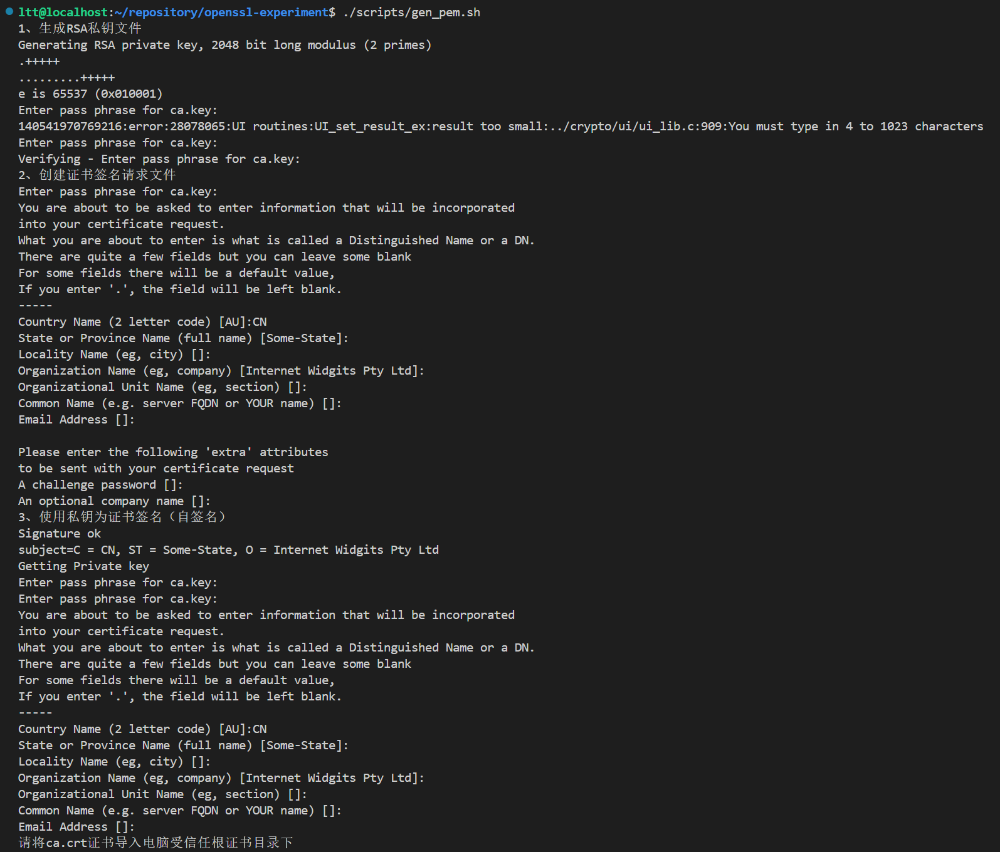
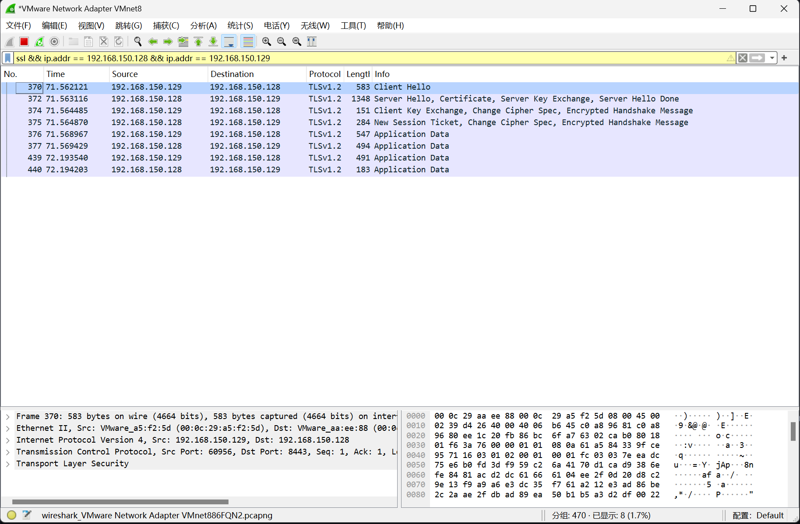
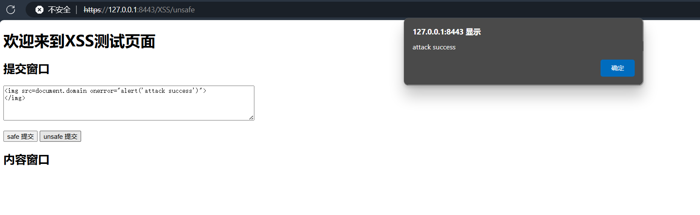
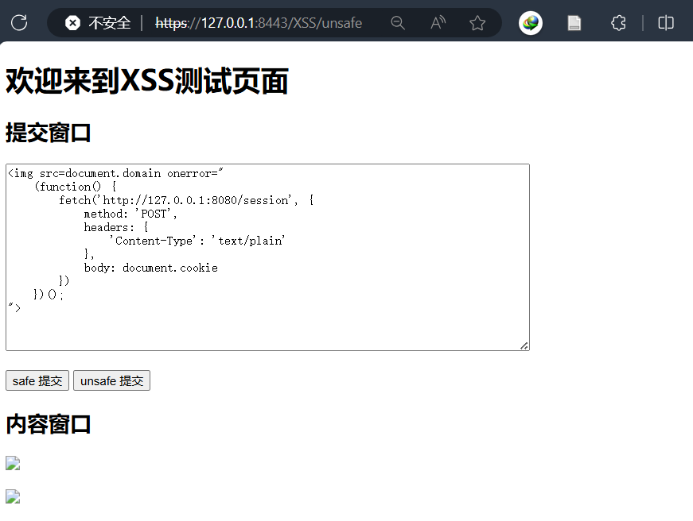
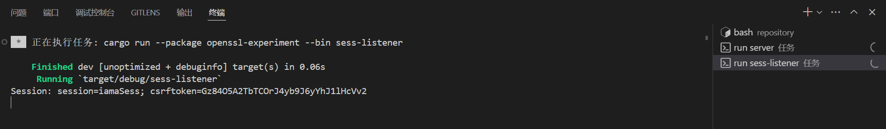

# openssl-experiment

这是一个基于Openssl的Web安全实验项目。主要工作如下：
1. 使用rust实现了一个简单的Http Web服务器，实现了有XSS漏洞的前端界面。
2. 使用openssl库新建了一个CA，签发了一个证书。
3. 将证书用于Web服务器，升级为Https Web服务器。
4. 使用rust语言实现了一个client程序，用于访问Https Web服务器。
6. 将client程序改写，可以自动填充XSS攻击脚本。
7. 设计了一个会话劫持的实验，用于演示XSS攻击的危害。

## 文件说明

- 文档：
   - `docs/SSL.md`：SSL协议的介绍以及实现
   - `docs/XSS.md`：XSS攻击的介绍以及实现
   - `docs/server.md`：服务端程序的介绍
   - `docs/client.md`：客户端程序的介绍
   - `docs/会话劫持.md`：会话劫持的介绍以及实现

- 服务端程序：
   - `src/bin/server.rs`：Https服务器程序
   - `src/bin/client.rs`：Https客户端程序
   - `src/bin/sess-listener.rs`：会话监听程序

- 证书生成程序：
   - `scripts/gen-pem.sh`：生成CA证书

- 前端界面：
   - `SSL/WebServer/XSS/index.html`：前端界面
   - `SSL/WebServer/XSS/handle.js`：前端界面的处理脚本

- 会话劫持实验：   
   - `SSL/WebServer/XSS/hook.js`：会话劫持攻击脚本
   - `SSL/WebServer/XSS/example.txt`：会话劫持示例
   - `SSL/WebServer/XSS/session.txt`：劫持到的cookie

## 运行环境

- `cargo 1.79.0-nightly`
- `OpenSSL 3.0.2 15 Mar 2022 (Library: OpenSSL 3.0.2 15 Mar 2022)`

## 运行方法

- 在根目录使用下列命令可以生成证书：

```bash
./scripts/gen-pem.sh
```

- 在根目录使用下列命令可以分别启动服务端、客户端、会话监听程序和XSS攻击程序：

```bash
cargo run --bin [server | client | sess-listener | xss-attack]
```

## 实验结果

### 基础结果展示

- 首先是实现好的Https服务器，可以在浏览器中访问到：
- 使用脚本生成证书的结果如下：

- 按照指导书的步骤，可以看到，客户机浏览器中已经得到了Server的证书。

- 在主机上运行Wireshark抓到的报文如下：


### XSS攻击结果

- 然后是实现好的XSS攻击界面，可以在浏览器中访问到：
- 浏览器访问`https://127.0.0.1/XSS/unsafe`，可以看到XSS攻击界面。

- 而在`https://127.0.0.1/XSS/safe`中，攻击是无效的。

### 会话劫持结果

- 最后就是关于会话劫持的实验，在`unsafe`版提交恶意脚本：


- 在监听服务器可以看到被劫持的cookie：

