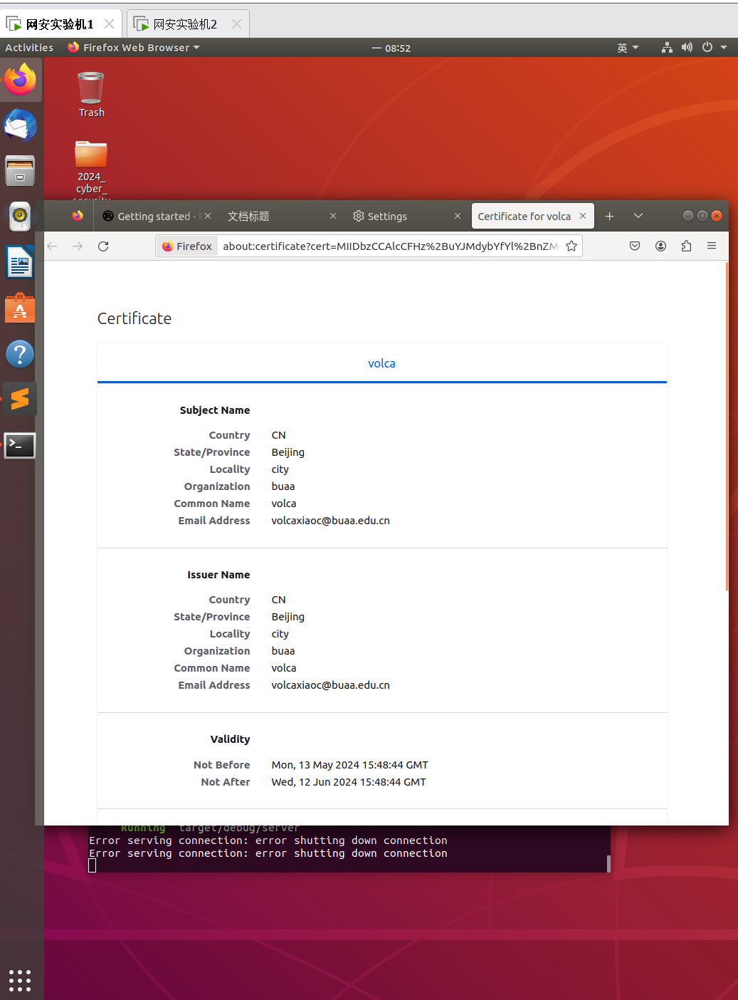
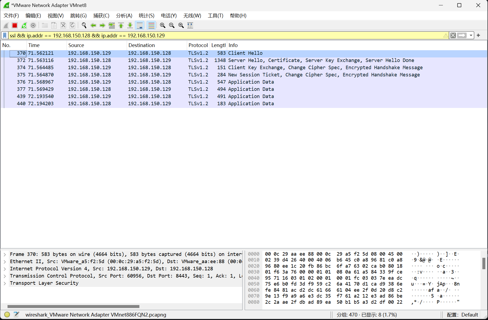

# openssl-experiment

小组在中期使用Rust语言实现了一版简单的server与client。

> 这是我们GitHub仓库的地址：[openssl-experiment](https://github.com/volcaxiao/openssl-experiment)

其中，server能够支持：
1. 加载 SSL 证书和私钥。
2. 监听特定的端口。
3. 处理Get请求。（其他请求暂时返回404）

client能够支持：
1. 与server建立SSL连接。
2. 发送Get请求。

并且在课程的虚拟机A上运行Server程序，在虚拟机B上运行Client程序。

## 功能测试

- 按照指导书的步骤，可以看到，客户机浏览器中已经得到了Server的证书。
- 
- 在主机上运行Wireshark抓到的报文如下：
- 

## 实验分析

- 现在对抓取到的报文进行分析：
- 握手阶段有4条报文：

1. **Client Hello 报文 (长度为 583 字节)：**
   - **TLS 版本：** 报文开始的几个字节表示 TLS 协议的版本。
   - **随机数：** 在 TLS 握手中，客户端会生成一个随机数，并在 `Client Hello` 报文中发送给服务器。这个随机数在后续的密钥协商中会被用到。
   - **支持的密码套件列表：** 客户端支持的加密算法和密钥交换算法的列表。每个密码套件由一个加密算法、一个密钥交换算法和一个消息认证码 (MAC) 算法组成。
   - **支持的压缩算法列表：** 客户端支持的数据压缩算法的列表。在 TLS 握手中，通常不使用压缩算法，因为压缩会导致安全风险。

2. **Server Hello 报文 (长度为 1348 字节)：**
   - **TLS 版本：** 与客户端支持的 TLS 版本相匹配。
   - **选择的密码套件：** 服务器从客户端提供的列表中选择一个最合适的密码套件，用于后续的通信。
   - **选择的压缩算法：** 服务器从客户端提供的列表中选择一个数据压缩算法。
   - **服务器随机数：** 服务器也生成一个随机数，并在 `Server Hello` 报文中发送给客户端。
   - **服务器证书：** 服务器在 `Server Hello` 报文中发送自己的数字证书，用于证明自己的身份。证书中包含了服务器的公钥。

3. **Client Key Exchange, Change Cipher Spec, Encrypted Handshake Message 报文 (长度为 151 字节)：**
   - **客户端密钥交换信息：** 客户端生成一个用于对称加密通信的随机密钥，并使用服务器的公钥加密这个密钥。
   - **改变密码规范 (Change Cipher Spec) 消息：** 客户端发送一个特殊的消息，通知服务器之后的通信会使用协商好的密钥。
   - **加密的握手消息：** 客户端发送一个 `Finished` 消息，包含一个验证握手消息的哈希值，使用之前协商好的对称密钥进行加密。

4. **New Session Ticket, Change Cipher Spec, Encrypted Handshake Message 报文 (长度为 284 字节)：**
   - **新会话票据：** 服务器发送一个新的会话票据给客户端，用于后续的会话恢复。
   - **改变密码规范 (Change Cipher Spec) 消息：** 服务器发送一个特殊的消息，通知客户端之后的通信会使用协商好的密钥。
   - **加密的握手消息：** 服务器发送一个 `Finished` 消息，包含一个验证握手消息的哈希值，使用之前协商好的对称密钥进行加密。

- 而后4条application data就是客户端与服务器之间的请求与响应，但是是加密之后的。

## 后期计划

- 将Server的Tls协议支持Tlsv1.3
- 继续实现Server Client的其他功能。
- 完成跨站脚本攻击（XSS），会话劫持，DOS攻击的攻防演练。

## 小组分工

- 罗皓天：实现Server程序。
- 戴波：实现Client程序。
- 肖灿：撰写文档，实验分析，配置openssl证书与链接。
