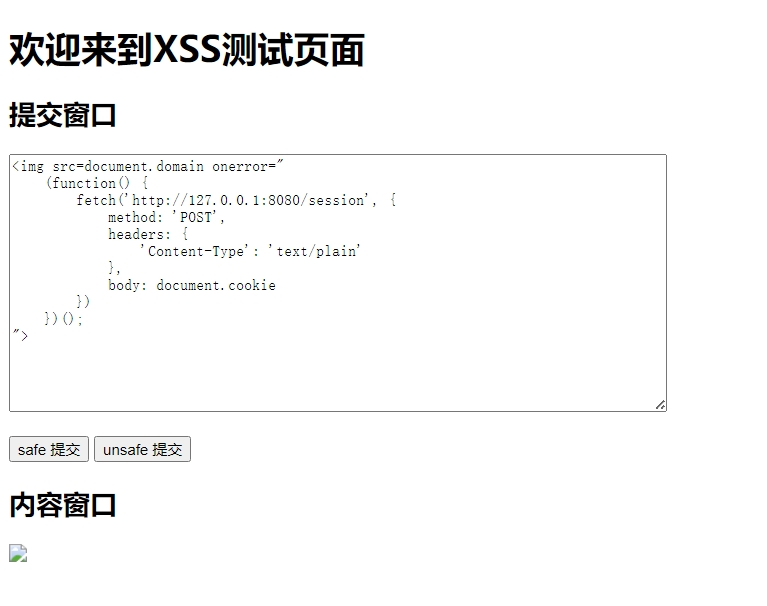

# XSS

## XSS 攻击

XSS(Cross-Site Scripting)跨站脚本攻击, 为不和层叠样式表(Cascading Style Sheets, CSS)的缩写混淆, 故将跨站脚本攻击缩写为 XSS。

XSS 是一种代码注入攻击。攻击者通过在目标网站上注入恶意代码, 使之在用户的浏览器上运行。利用这些恶意代码, 攻击者可获取用户的敏感信息如: Cookie、SessionID 等, 进而危害数据安全。

## XSS 攻击原理

XSS 攻击原理: 

- 攻击者将恶意代码注入到目标网站上, 当用户浏览该网站时, 恶意代码会自动执行, 从而达到攻击者的目的。
- 恶意代码通常以 JavaScript 代码的形式存在, 但也可以是 Java、VBScript、ActiveX 等其他形式。
- 恶意代码可以包含在网页的 HTML 代码中, 也可以是来自其他网站的图像、视频等资源。
- 恶意代码可以隐藏在正常内容中, 很难被检测出来。

## XSS 攻击防御

XSS 攻击的防御是针对攻击者注入的恶意代码进行过滤、转义和校正。
- 转义: 对特殊字符进行转义, 如 `<` 转换为 `&lt;`, `>` 转换为 `&gt;`。
- 校正: 对输入进行校正, 如过滤掉 HTML 标签。
- 内容安全策略(Content Security Policy, CSP): 通过设置 HTTP 头部 `Content-Security-Policy` 来限制页面的加载和执行的资源, 从而防止 XSS 攻击。

## API 接口
- 定义安全和不安全的接口, 用于测试 XSS 攻击
### Get
- 设置内容安全策略
	- `/XSS/safe`
- 未设置内容安全策略
	- `/XSS/unsafe`

### Post
- 过滤输入
	- `/XSS/safe`
- 未过滤输入
	- `/XSS/unsafe`

## 实现

### 易遭受 XSS 攻击的网页

- 位于 `SSL/WebServer/XSS` 文件夹下

#### 功能

- 使用 `https://127.0.0.1:8443/XSS/unsafe` 或 `https://127.0.0.1:8443/XSS/safe` 进行访问
- 使用 POST 方法将用户输入发送到 Web 服务器
  - 可以选择使用安全的 POST 和不安全的 POST
- 从 Web 服务器读取输入并展示在界面上



### server

#### safe GET 方法 实现

1. 定义 CSP 内容安全策略

   ```rust
   // 定义一个基本的 CSP 策略字符串, 允许从当前源加载, 并且只允许内联样式
   let csp_header_value = "default-src 'self'; script-src 'self';";
   let csp_header = HeaderValue::from_str(csp_header_value)
       .expect("Failed to convert CSP string into HeaderValue");
   ```

2. 在访问 `XSS/safe` 时返回包含 CSP 字段的 http 首部

   ```rust
   // 路由
   "/XSS/safe" => {
       let file_path = format!("{}/XSS/index.html", ROOT_PATH);
       match read_file(file_path.as_str()) {
           Ok(buf) => {
               // 创建响应
               let mut response = Response::new(Full::new(Bytes::from(buf)));
               // 添加 cookie 头
               response.headers_mut().insert(header::SET_COOKIE, cookie);
               // 添加 CSP 头
               response.headers_mut().insert(header::CONTENT_SECURITY_POLICY, csp_header);
               Ok(response)
           },
           Err(_) => {
               let response = Response::new(Full::new(Bytes::from("404 Not Found")));
               Ok(response)
           }
       }
   },
   ```


### unsafe GET 方法实现

1. 作为对照, 不添加 CSP 头

   ```rust
   "/XSS/unsafe" => {
       let file_path = format!("{}/XSS/index.html", ROOT_PATH);
       match read_file(file_path.as_str()) {
           Ok(buf) => {
               // 生成响应
               let mut response = Response::new(Full::new(Bytes::from(buf)));
               // 添加 cookie 头
               response.headers_mut().insert(header::SET_COOKIE, cookie);
               Ok(response)
           },
           Err(_) => {
               let response = Response::new(Full::new(Bytes::from("404 Not Found")));
               Ok(response)
           }
       }
   },
   ```

### 获取用户输入

```rust
"/XSS/input" => {
    let file_path = format!("{}/XSS/input.txt", ROOT_PATH);
    match read_file(file_path.as_str()) {
        Ok(buf) => {
            let response = Response::new(Full::new(Bytes::from(buf)));
            Ok(response)
        },
        Err(_) => {
            let response = Response::new(Full::new(Bytes::from("404 Not Found")));
            Ok(response)
        }
    }
},
```

读取本地文件, 作为响应返回

### safe POST 方法实现

```rust
"/XSS/safe" => {
    let file_path = format!("{}/XSS/input.txt", ROOT_PATH);
    // 使用 ammonia 库来清理 HTML 内容
    let body = ammonia::clean(&body);
    // 将过滤后输入存入文件
    match write_file(&file_path, &body) {
        Ok(_) => {
            let response = Response::new(Full::new(Bytes::from("OK")));
            Ok(response)
        },
        Err(_) => {
            let response = Response::new(Full::new(Bytes::from("404 Not Found")));
            Ok(response)
        }
    }
},
```

调用 `ammonia` 库, 移除不安全的 HTML 标签和属性, 从而防止跨站脚本攻击(XSS)


### unsafe POST 方法实现

```rust
"/XSS/unsafe" => {
    let file_path = format!("{}/XSS/input.txt", ROOT_PATH);
    // 将输入直接存入文件
    match write_file(&file_path, &body) {
        Ok(_) => {
            let response = Response::new(Full::new(Bytes::from("OK"))); 
            Ok(response)
        },
        Err(_) => {
            let response = Response::new(Full::new(Bytes::from("404 Not Found")));
            Ok(response)
        }
    }
}
```

作为对照, 不对输入做任何处理


## 测试

### unsafe GET + unsafe POST


1. 运行服务器

2. 打开页面 `https://127.0.0.1:8443/XSS/unsafe`

3. 输入

   ```html
   
   </img>
   ```

4. 点击 unsafe 提交

5. 页面会从服务器加载输入的内容, 可以观察到 XSS 攻击成功

#### 分析

1. 提交内容后, 使用 get 方法获取 `input.txt`
2. 加载内容时渲染 img, 由于 src 无效, 执行 onerror 方法
3. onerror 可以由攻击者随意指定, 这里以弹出提示框为例

### safe GET + unsafe POST


1. 运行服务器

2. 打开页面 `https://127.0.0.1:8443/XSS/safe`

3. 输入

   ```html
   
   </img>
   ```

4. 点击 unsafe 提交

5. 页面会从服务器加载输入的内容, 可以观察到 XSS 攻击失败

#### 分析

1. 检查网页, 输入内容成功加载到网页中

   ```html
   <p id="content">
   </p>
   ```

   

2. 打开控制台, 观察到以下输出

   ```none
   Refused to execute inline event handler because it violates the following Content Security Policy directive: "script-src 'self'". Either the 'unsafe-inline' keyword, a hash ('sha256-...'), or a nonce ('nonce-...') is required to enable inline execution. Note that hashes do not apply to event handlers, style attributes and javascript: navigations unless the 'unsafe-hashes' keyword is present.
   ```

3. 脚本执行被阻止, 说明内容安全策略按照预期工作


### unsafe GET + safe POST


1. 运行服务器

2. 打开页面 `https://127.0.0.1:8443/XSS/unsafe`

3. 输入

   ```html
   
   </img>
   ```

4. 点击 unsafe 提交

5. 页面会从服务器加载输入的内容, 并没有提示框出现, XSS 攻击失败

#### 分析

1. 检查网页

   ```html
   <p id="content">
   </p>
   ```

2. 输入内容已经被过滤, 不在具有 XSS 攻击威胁
