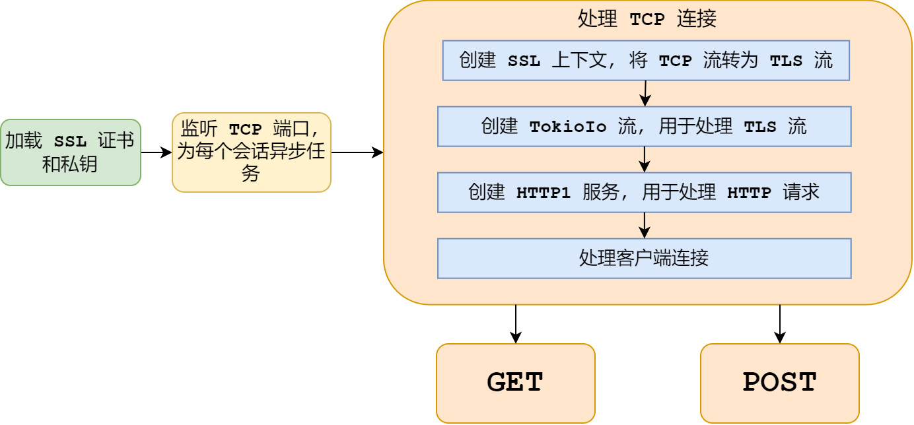

# Server 实现

## Rust 库

### hyper

`hyper` 是一个高性能的 HTTP 库, 用于构建快速、可靠的 HTTP 客户端和服务器。它提供了底层的 HTTP 实现, 支持 HTTP/1 和 HTTP/2 协议, 并且具有异步编程模型, 可以与 `Tokio` 等异步运行时一起使用。`hyper` 适用于需要高吞吐量和低延迟的网络应用程序, 如微服务、API 网关和 Web 服务器。

### openssl

`openssl` 是一个用于处理加密、解密和安全通信的 Rust 库, 它是对 OpenSSL 库的绑定。`openssl` 提供了全面的加密功能, 包括对称加密、非对称加密、哈希函数和数字签名。此外, 它还支持 TLS/SSL 协议, 用于保护网络通信的安全。`openssl` 适用于需要加密数据传输、身份验证和数据完整性的应用程序。

### tokio

`tokio` 是一个基于 Rust 的异步运行时, 用于构建高并发、低延迟的网络应用程序。它提供了异步 I/O、任务调度和并发原语, 支持多种协议和网络操作。`tokio` 允许开发者以非阻塞的方式编写高效的网络代码, 适用于需要处理大量并发连接的应用场景, 如实时消息系统、WebSocket 服务器和异步微服务。

### ammonia

`ammonia` 是一个用于清理和过滤 HTML 内容的 Rust 库。它移除不安全的 HTML 标签和属性, 防止跨站脚本攻击 (XSS)。`ammonia` 允许用户自定义白名单, 决定哪些标签、属性和 URI 协议是被允许的, 从而提供灵活的 HTML 清理功能。它适用于处理用户生成内容的应用程序, 如博客、论坛和内容管理系统 (CMS), 确保这些内容的安全性。


## 实现



### 加载 SSL 证书和密钥

```rust
// 加载 SSL 证书和私钥
let mut acceptor = SslAcceptor::mozilla_intermediate(SslMethod::tls()).unwrap();
acceptor
    .set_private_key_file(format!("{}/ca.key", CERT_PATH), SslFiletype::PEM)
    .unwrap();
acceptor
    .set_certificate_chain_file(format!("{}/ca.crt", CERT_PATH))
    .unwrap();
acceptor.check_private_key().unwrap();
let acceptor = Arc::new(acceptor.build());
```

### 处理 TCP 连接

```rust
// 监听端口
let listener = TcpListener::bind("127.0.0.1:8443").await?;

loop {
    // 处理 TCP 连接
    match listener.accept().await {
        Ok((stream, _)) => {
            let acceptor = acceptor.clone();

            // 异步 tokio::spawn 函数，用于处理客户端连接
            tokio::spawn(async move {
                // 创建 SSL 上下文
                let ssl = Ssl::new(acceptor.context()).unwrap();

                // 创建 SSL 流
                let mut tls_stream = match SslStream::new(ssl, stream) {
                    Ok(stream) => stream,
                    Err(err) => {
                        eprintln!("Error creating SSL stream: {}", err);
                        return;
                    }
                };

                // 接受客户端连接
                if let Err(error) = SslStream::accept(Pin::new(&mut tls_stream)).await {
                    // 接受连接失败
                    eprintln!("Error accepting connection: {}", error);
                    return;
                }
                // 创建 TokioIo 流
                let stream = TokioIo::new(tls_stream);
                // 创建 HTTP1 服务
                let conn = http1::Builder::new().serve_connection(stream, service_fn(handle));
                // 处理客户端连接
                if let Err(err) = conn.await {
                    // 处理连接失败
                    eprintln!("Error serving connection: {}", err);
                    return;
                }
            });
        }
        Err(err) => {
            eprintln!("Error accepting connection: {}", err)
        }
    };
}
```

1. 监听 TCP 端口, 为每个会话异步任务
2. 创建 SSL 上下文, 将 TCP 流转为 TLS 流
3. 创建 TokioIo 流, 用于处理 TLS 流
4. 创建 HTTP1 服务, 用于处理 HTTP 请求
5. 处理客户端连接

### handle 

```rust
// 异步函数，处理请求
async fn handle(
    request: Request<hyper::body::Incoming>,
) -> Result<Response<Full<Bytes>>, Infallible> {
    // 根据请求方法，调用相应的处理函数
    match *request.method() {
        hyper::Method::GET => handle_get(request).await,
        hyper::Method::POST => handle_post(request).await,
        _ => {
            // 如果请求方法不是GET或POST，返回404错误
            let response = Response::builder()
                .status(hyper::StatusCode::NOT_FOUND)
                .body(Full::new(Bytes::from("404 Not Found")))
                .unwrap();
            Ok(response)
        }
    }
}
```

处理 GET 和 POST 请求
